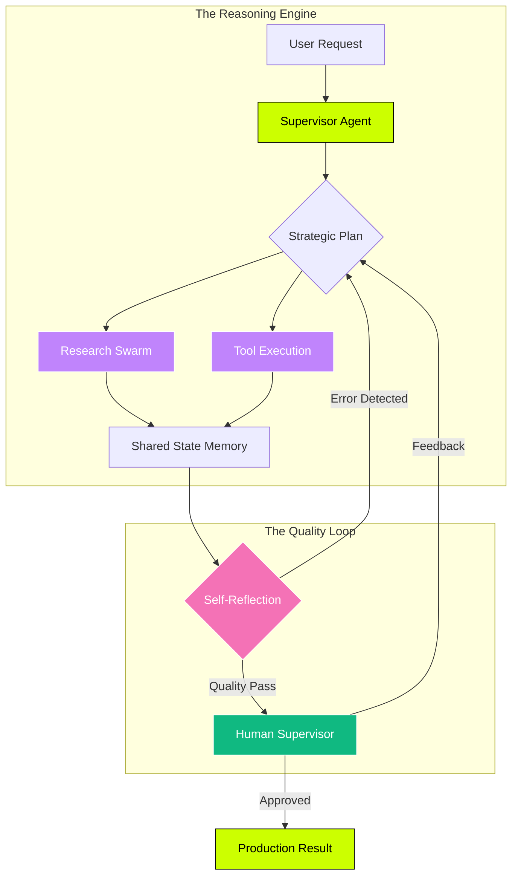

  <!-- Primary Brand Animation -->
  
  
  <!-- System Boot Sequence Animation -->
  

---

### 🧠 My "Agentic" Workflow

| 🚀 The Mission | 🎯 Key Outcomes |
| :--- | :--- |
| **I build state machines that don't loop and retrievers that actually find data.** My focus is on moving beyond "notebook demos" to AI systems that drive real business value. | • **40%** Support Load Reduction • **65%** LLM Cost Savings • **<2min** Lead Response Time |

---

### 🛡️ Core Directives
*   **01. Policy Over Prompting:** Security and logic belong in the state machine, not just the prompt.
*   **02. Deterministic Evals:** If it isn't measured with an eval harness, it isn't ready for production.
*   **03. Human-in-the-Loop:** Designing for safety by keeping humans as the final supervisor for high-risk actions.

### 🧪 Active Research Lab
- 🔬 **Small Language Models (SLMs):** Optimizing edge-deployment for sub-second latency.
- 🔗 **Multi-Agent Consensus:** Improving reliability in swarms through voting protocols.
- 📉 **Token Compression:** Novel RAG strategies to minimize prompt bloat.

---

### 🛠 The Intelligence Stack

| **Category** | **Technologies** |
| :--- | :--- |
| **Core AI Frameworks** |      |
| **Data & Vector Memory** |     |
| **Automation & Scraping** |     |
| **Full-Stack & Infra** |      |
| **Observability & Evals** |    |

---

### 📥 Let's build something autonomous
[**Book a Scoping Call**](https://calendly.com/tayyabjaved) | [**View Portfolio**](https://tayyabjaved.com) | [**LinkedIn**](https://linkedin.com/in/tayyabjaved)

*"The best agents are the ones you forget are there."*
