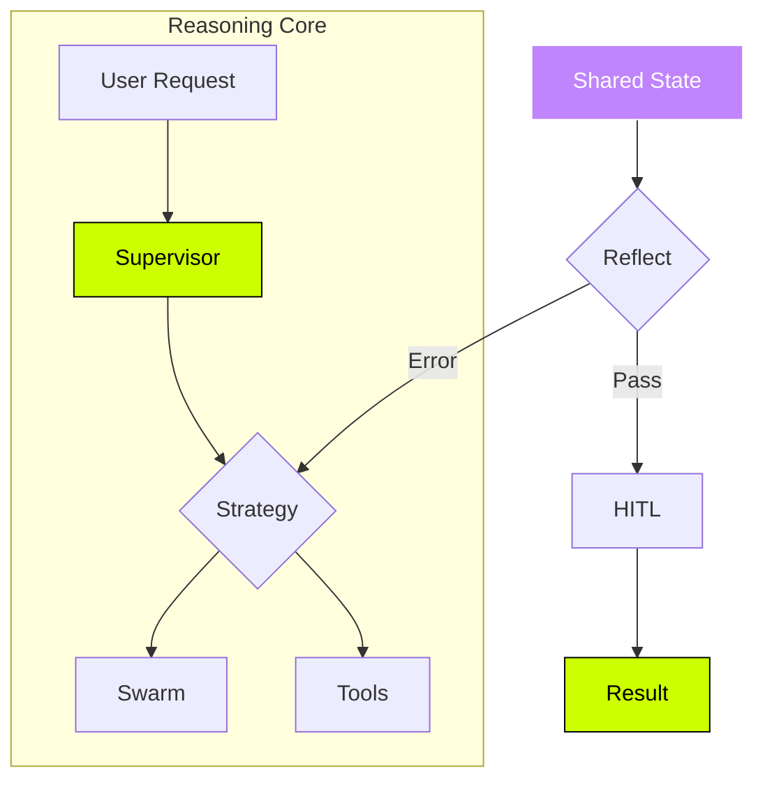

  <!-- Centered Identity -->
  
  
  <!-- Social Badges -->
  
  
  

---

### 🏆 GitHub Achievements

  

---

### 🧠 System Architecture

| ⚡ Activity Pulse | 🛠 The Stack |
| :--- | :--- |
|  | **AI:** LangGraph, LangChain, CrewAI **Data:** Supabase, pgvector, Redis **Ops:** Playwright, n8n, Docker |

---

### 🚀 Launching Production Agents
- 🎧 **Support Agent:** Cut handle time by 40%.
- 💰 **Cost Opt:** Saved 65% in LLM tokens.
- 🎯 **Lead Qual:** Response time < 2 mins.

*"I ship agents to production, not to notebooks."*
